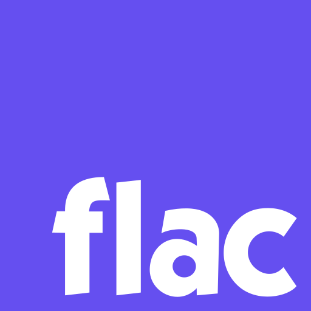

<h1>flac.wasm</h1>

Run official FLAC tools `flac` and `metaflac` as WebAssembly, on browsers or Deno.

> Currently we have no plans on supporting Node.js.

[Try it online!](https://flac.vercel.app)

## Usage

For usage of `flac`, please refer to [its documentation](./wasm/flac/README.md).

For usage of `metaflac`, please refer to [its documentation](./wasm/metaflac/README.md).

## License

GPL v2

Copyright (c) 2022-present Pig Fang

Logo is based on the official FLAC logo which is licensed under [GNU FDL](https://github.com/xiph/flac/blob/master/COPYING.FDL).
